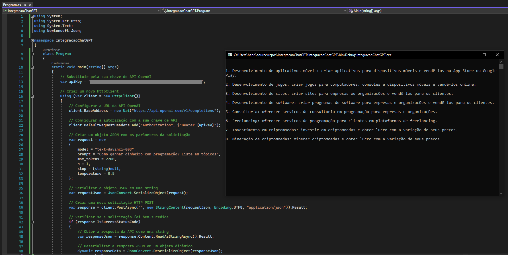

# Integracao-ChatGPT-CSharp :space_invader: :computer: :speech_balloon:
O objetivo do projeto é fazer uma integração simples com a API do ChatGPT através da linguagem C# - utilizando o aplicativo do console (.NET Framework). 
> O projeto foi feito sem importar o pocote NuGet da OpenAI, relizei a conexão com a API por meio dos protocolos HTTP (Post)

## Imagem :camera:

## Ferramentas :hammer_and_wrench:
Ferramentas utilizadas na construção do projeto:
- C#;
- NewtonSoft;
- API ChatGPT.
